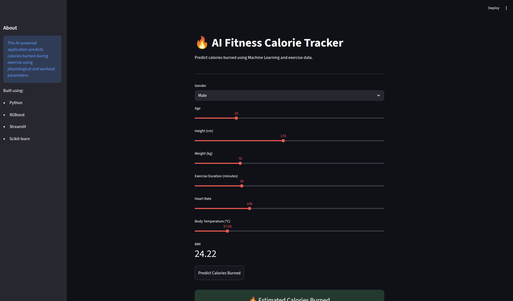
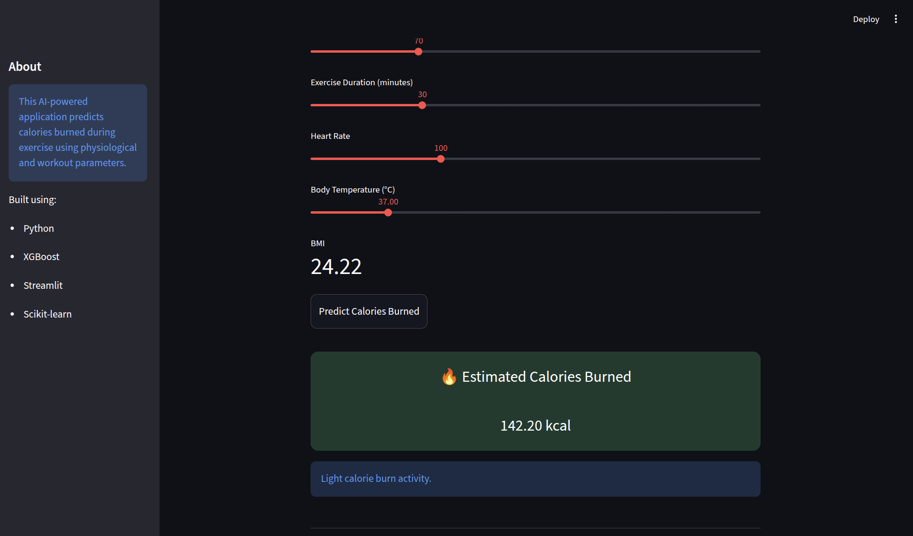
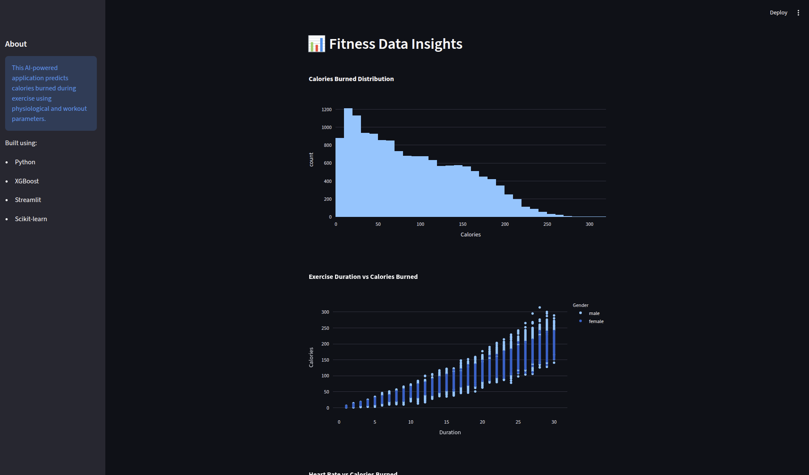

# 🔥 AI Fitness Calorie Tracker

An AI-powered fitness analytics application that predicts calories burned during exercise using Machine Learning and physiological data.

Built using:
- Python
- XGBoost
- Streamlit
- Scikit-learn
- Plotly

---

# 🚀 Features

✅ Predict calories burned during exercise  
✅ Interactive Streamlit web application  
✅ BMI calculator  
✅ Workout intensity insights  
✅ Interactive analytics dashboard  
✅ Feature importance visualization  
✅ Machine Learning powered predictions  

---

# 📊 Machine Learning Model

The application uses an XGBoost Regressor trained on exercise and physiological data.

### Input Features
- Gender
- Age
- Height
- Weight
- Exercise Duration
- Heart Rate
- Body Temperature

### Model Performance

- R² Score: ~0.99
- Mean Absolute Error: Very Low

---

# 🖥️ Application Screenshots

## 🏠 Home Page



---

## 🔥 Prediction System



---

## 📈 Analytics Dashboard



---

# 📌 Feature Importance

The application also provides feature importance analysis to understand which parameters most influence calorie burn predictions.

Key observations:
- Exercise Duration has the highest impact
- Heart Rate strongly influences predictions
- Weight and Age contribute moderately

---

# 🛠️ Tech Stack

## Languages
- Python

## Libraries & Frameworks
- Pandas
- NumPy
- Scikit-learn
- XGBoost
- Streamlit
- Plotly

---

# ⚙️ Installation

## Clone Repository

```bash
git clone <your-github-repo-link>
```

## Install Dependencies

```bash
pip install -r requirements.txt
```

## Run Application

```bash
streamlit run app/app.py
```

---

# 📂 Project Structure

```text
AI-Calorie-Tracker/
│
├── app/
│   ├── app.py
│   ├── model.pkl
│
├── data/
│   ├── calories.csv
│   └── exercise.csv
│
├── notebook/
│   └── calorie.ipynb
│
├── screenshots/
│   ├── home.png
│   ├── prediction.png
│   └── dashboard.png
│
├── train_model.py
├── requirements.txt
└── README.md
```

---

# 🔮 Future Improvements

- User authentication
- Workout recommendation system
- Diet recommendation engine
- Cloud deployment
- Mobile responsive UI
- AI fitness chatbot

---

# 👨‍💻 Author

Soham Kadam

Built with Machine Learning and Streamlit.